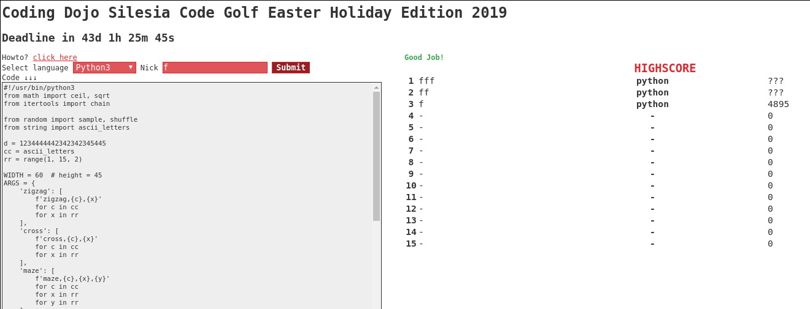
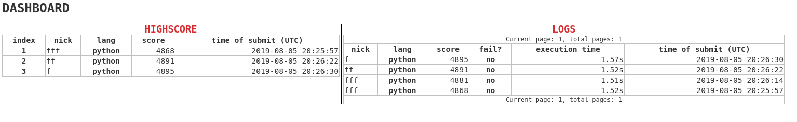

# Golf server

python&flask based webserver to play [code golf](https://en.wikipedia.org/wiki/Code_golf) with logic to validate the code, count chars and higscore table.

## tl;dr?

Go to [Howto](#howto)

## Features

* webpanel to insert code
* highscore table
* supports javascript, ruby, python and php
* little dashboard to show full highscore and log of tries (failed or not)

## OMG SCREENSHOTS

### Main page with highscore




### Dashboard




## Why?

Because codegolf is a nice fun for small IT communities like meetups, hackerspaces, conferences and offices. 

## History

TODO

## Howto

### install & run

```bash
cp example_env .env
vim .env
docker-compose up -d db
docker-compose up -d --build app
# done!
```

### dev version (with autoreload)

```bash
docker-compose up -d db
docker-compose -f docker-compose.dev.yml up app
```

### sql console

```bash
./sql_console.sh
```

### updating server

```bash
docker-compose stop app && docker-compose up --build -d app
```

## URLs

* `/` - main site
* `/<TOKEN>/dashboard` - simple dashboard - about token please see below

## Configuration

Whole configuration is based on ENVs - see example.env file

* `FLASK_DB` - URL to database - see `SQLALCHEMY_DATABASE_URI` in https://flask-sqlalchemy.palletsprojects.com/en/2.x/config/
* `POSTGRES_XXX` - used to postgres database - if you have another database (not from docker compose) then you can omit this envs
* `START_DATE` - UTC date when will be started
* `END_DATE` - UTC date when golf will be finished
* `DASHBOARD_TOKEN` - random string to URL to make 'little secure' dashboard
* `MAX_SCORES_ON_MAIN_PAGE` - how many nicks can show on highscore
* `TOP_HIDE_SCORES` - to avoid traps (like insert better score 5 minutes before end of golf), we make a value to how many the highest scores can hide (replaced with ???)

## Technology

* python3
* flask
* nsjail
* docker omg!
* love

## Contributors

* [firemark](https://github.com/firemark/) (main developer)
* [inirudebwoy](https://github.com/inirudebwoy)
* [dmazur](https://github.com/dmazur)
